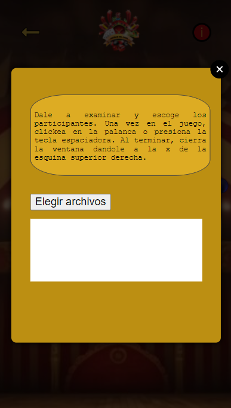

# Random_Lucky
# Reinas del Dom

El objetivo es jugar con una tragaperras, en la que puedas añadir tus propias imágenes desde tu  propio ordenador.
El jugador podrá seleccionar los participantes del juego dándole al botón "Elegir Archivos" y escogiendo las fotos.
Una vez seleccionados le dará a la palanca y se exhibirá el resultado en la máquina tragaperras.

## Instrucciones

El jugador podrá seleccionar los participantes del juego dándole al botón "Elegir Archivos" y escogiendo las fotos.
Una vez seleccionados  Al terminar, cierra la ventana dandole a la x de la esquina superior derecha. Una vez en el juego habrá que hacer click en la palanca o presiona la tecla espaciadora para inicializar el juego.

## Authors

- [@Fire-Fairy84](https://github.com/Fire-Fairy84)
- [@helopgom](https://github.com/helopgom)
- [@indiakka](https://www.github.com/indiakka)
- [@limonadaweb](https://www.github.com/limonadaweb)

## Screenshots

#)

